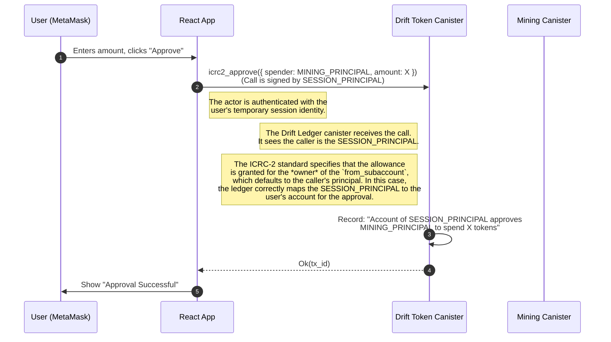

# Definitive Implementation Guide: React + ic-siwe-provider

**Objective:** To serve as a complete, single source of truth for developers integrating the `ic-siwe-provider` canister into a production-grade React application. This document covers architecture, step-by-step file creation, detailed code explanations, and common troubleshooting steps.

---

## 1. Prerequisites

Before you begin, ensure you have the following tools installed and configured:

- **Node.js** (v18 or later)
- **pnpm** (or your preferred package manager like npm/yarn)
- **DFINITY Canister SDK** (`dfx`)
- An **Ethereum Wallet** browser extension (e.g., MetaMask)

---

## 2. Core Architecture & Concepts

This architecture enables users to authenticate and interact with your Internet Computer dApp using only their Ethereum wallet. It's built on a non-custodial, on-chain verification model.

### Key Architectural Pillars

1.  **Session Principal (Temporary ID)**: When a user signs in, a unique, temporary IC identity is generated for that specific session. This identity is what your backend canisters see as `ic_cdk::caller()`. Its only purpose is to prove that the user is currently authenticated. It expires and is discarded when the user logs out or the session ends.

2.  **Stable Principal (Permanent ID)**: This is a permanent, unchanging IC identity that is deterministically derived from the user's Ethereum address. This is the principal that should **own all assets** (e.g., ICRC-2 tokens, NFTs). It is the user's "true" identity within your application's logic.

3.  **On-Chain Verification**: Your business logic canisters **must never** trust the `caller()` (the session principal) for asset ownership. Instead, for any sensitive operation, they must perform a cross-canister call to the `ic-siwe-provider`. The provider acts as the source of truth, verifying the temporary session principal and returning the user's permanent stable principal and Ethereum address.

### Component Roles & Libraries

- **React**: The frontend framework.
- **Wagmi & Viem**: The core libraries for connecting to the user's Ethereum wallet (MetaMask, etc.) and handling wallet-related interactions like signing messages.
- **`siwe`**: A library for constructing and verifying EIP-4361 "Sign-In with Ethereum" messages in a standard format.
- **`ic-siwe-js`**: The primary client-side library that provides the React context (`<SiweIdentityProvider>`) and hooks (`useSiwe`) to manage the entire authentication flow with the `ic-siwe-provider` canister.
- **`ic-use-actor`**: A powerful React library for managing IC canister actors. It provides a clean, hook-based pattern (`<ActorProvider>`, `useActor`) to interact with canisters without boilerplate.
- **`@dfinity/agent` & `@dfinity/principal`**: The foundational JavaScript libraries for all interactions with the Internet Computer.

### High-Level Data Flow

```mermaid
graph TD
    subgraph "User's Browser (React App)"
        A[Wagmi: Connect Wallet] --> B{useSiwe Hook};
        B -- "1. prepare_login()" --> C[ic-siwe-provider Actor];
        C -- "2. Returns SIWE Message" --> B;
        B -- "3. User Signs Message" --> D[Wagmi: signMessage];
        D -- "4. Signature" --> B;
        B -- "5. login(signature)" --> C;
        C -- "6. Returns Session Identity" --> B;
        B -- "7. Updates React Context" --> E[Global App State];
    end

    subgraph "Internet Computer"
        C[ic-siwe-provider Canister];
        F[Your Canister (e.g., Tokens)];
    end

    subgraph "Authenticated Call"
        G[UI Component] -- "8. use[Your]Actor()" --> H[ic-use-actor];
        H -- "9. Actor call (signed with Session ID)" --> F;
        F -- "10. get_address(caller())" --> C;
        C -- "11. Returns ETH Address" --> F;
        F -- "12. Logic using Stable Principal" --> F;
        F -- "13. Returns Result" --> H;
    end
```

---

## 3. Step-by-Step Project Setup

This section details every file and configuration needed.

### Step 1: Install All Dependencies

In your project's root directory, run:

```bash
pnpm install wagmi viem siwe ic-siwe-js ic-use-actor @dfinity/agent @dfinity/principal @tanstack/react-query react-hot-toast
```

### Step 2: Centralize Canister IDs

This is a best practice for managing different deployment environments.

**Create File: `src/frontend/src/ic/canister_ids.json`**

```json
{
  "ic_siwe_provider": {
    "local": "bkyz2-fmaaa-aaaaa-qaaaq-cai",
    "mainnet": "nmepf-siaaa-aaaaj-qnsia-cai"
  },
  "drift_token": {
    "local": "br5f7-7uaaa-aaaaa-qaaca-cai",
    "mainnet": "5lkcq-gaaaa-aaaaj-qnrfq-cai"
  },
  "ak69_token": {
    "local": "bd3sg-teaaa-aaaaa-qaaba-cai",
    "mainnet": "zm55w-7aaaa-aaaae-qffrq-cai"
  }
}
```

- **Purpose**: To avoid hardcoding canister IDs. Your code will read from this file based on an environment variable.

### Step 3: Configure Vite

Vite needs to be configured to handle the IC development environment and expose variables to the browser.

**Modify File: `vite.config.ts`**

```typescript
import { defineConfig } from "vite";
import react from "@vitejs/plugin-react";
import { resolve } from "path";

const network = process.env.DFX_NETWORK || "local";

export default defineConfig({
  plugins: [react()],
  // 1. Point Vite to your frontend's entry point
  root: "src/frontend",
  resolve: {
    alias: {
      "@": resolve(__dirname, "src"),
    },
  },
  // 2. Conditionally set up the proxy for local development ONLY
  server:
    network === "local"
      ? {
          proxy: {
            "/api": {
              target: "http://12.0.0.1:4943",
              changeOrigin: true,
            },
          },
        }
      : undefined,
  define: {
    // 3. Expose DFX_NETWORK to the browser
    "process.env.DFX_NETWORK": JSON.stringify(network),
    // 4. Polyfill 'global' for libraries that need it
    global: "globalThis",
  },
});
```

- **`root`**: Tells Vite where `index.html` is.
- **`server.proxy`**: For local development, this forwards canister calls from the browser to the local replica. It's disabled for mainnet builds.
- **`define`**: This is the crucial part that makes environment variables and polyfills available in your browser code.

### Step 4: Generate Canister Typings

Your React code needs TypeScript definitions to interact with your canisters safely.

- **For Canisters in your Project (`dfx.json`)**:
  ```bash
  dfx generate <canister_name>
  ```
- **For External Canisters (e.g., your tokens)**: Since they are not in `dfx.json`, you must generate their typings manually.

  1.  **Create a Candid file (`.did`)**: This file describes the canister's public interface. For standard tokens like ICRC-1/2, you can use a generic template.
  2.  **Convert `.did` to `.did.ts`**: Use an online tool or `didc` if you have it installed to generate the TypeScript file.
  3.  **Create an `index.ts` re-exporter**: This makes imports cleaner.

  **Example for `drift_token`:**

  - `src/frontend/declarations/drift_token/drift_token.did.ts` (Generated TS)
  - **Create File: `src/frontend/declarations/drift_token/index.ts`**
    ```typescript
    // This exports the 'idlFactory' value
    export { idlFactory } from "./drift_token.did";
    // This exports the '_SERVICE' type for use in TypeScript
    export type { _SERVICE } from "./drift_token.did";
    ```

---

## 4. Application Wiring & Providers

This section details how to structure your React application's entry point to provide all necessary contexts.

### File 1: The Application Root (`main.tsx`)

This file sets up the provider hierarchy. The order is important as inner components depend on outer ones.

**Modify File: `src/frontend/src/main.tsx`**

```typescript
// ... imports
import ActorProviders from "./ic/actor_providers.tsx";
import { SiweIdentityProvider } from "ic-siwe-js/react";
import canisterIds from "./ic/canister_ids.json";

const queryClient = new QueryClient();

// Read the env var from Vite and determine network/host
const networkEnv = process.env.DFX_NETWORK || "local";
const network = networkEnv === "ic" ? "mainnet" : "local";
const isMainnet = network === "mainnet";
const siweProviderCanisterId = canisterIds.ic_siwe_provider[network];
const host = isMainnet ? "https://icp-api.io" : "http://127.0.0.1:4943";

ReactDOM.createRoot(document.getElementById("root")!).render(
  <React.StrictMode>
    <WagmiProvider config={wagmiConfig}> {/* For Ethereum Wallet */}
      <QueryClientProvider client={queryClient}> {/* For Wagmi */}
        <SiweIdentityProvider
          canisterId={siweProviderCanisterId}
          httpAgentOptions={{ host }} {/* Manages SIWE session */}
        >
          <ActorProviders> {/* Provides all canister actors */}
            <AuthGuard> {/* Protects routes */}
              <App />
            </AuthGuard>
          </ActorProviders>
        </SiweIdentityProvider>
      </QueryClientProvider>
    </WagmiProvider>
    <Toaster />
  </React.StrictMode>
);
```

- **`<SiweIdentityProvider>`**: This is the core of the SIWE integration. It holds the session state (identity, login status) and provides it to the rest of the app via the `useSiwe` hook. The `httpAgentOptions={{ host }}` prop is **essential** for telling it where the IC network is (local or mainnet).

### File 2: Centralized Actor Management (`actor_providers.tsx`)

This file is the best-practice way to manage multiple canister actors in a large application.

**Create File: `src/frontend/src/ic/actor_providers.tsx`**

```typescript
import {
  ActorProvider,
  createActorContext,
  createUseActorHook,
} from "ic-use-actor";
// ... imports for idlFactories and canisterIds
import { useSiwe } from "ic-siwe-js/react";
// ... imports for service types

// Determine network and host
const networkEnv = process.env.DFX_NETWORK || "local";
const network = networkEnv === "ic" ? "mainnet" : "local";
const host =
  network === "mainnet" ? "https://icp-api.io" : "http://127.0.0.1:4943";

// 1. Create a distinct React Context for each actor
const siweProviderContext = createActorContext<SiweProviderService>();
const driftTokenContext = createActorContext<TokenService>();
const ak69TokenContext = createActorContext<TokenService>();

// 2. Create a distinct, exported hook for each actor
export const useSiweProviderActor =
  createUseActorHook<SiweProviderService>(siweProviderContext);
export const useDriftTokenActor =
  createUseActorHook<TokenService>(driftTokenContext);
export const useAk69TokenActor =
  createUseActorHook<TokenService>(ak69TokenContext);

// 3. Create a single Provider component that nests all individual ActorProviders
export default function ActorProviders({ children }: { children: ReactNode }) {
  const { identity } = useSiwe(); // Get the current session identity

  // Get canister IDs from our JSON config
  const siwe_provider_canister_id = canisterIds.ic_siwe_provider[network];
  // ... get other canister IDs

  return (
    <ActorProvider
      canisterId={siwe_provider_canister_id}
      context={siweProviderContext}
      identity={identity} // Pass the session identity
      idlFactory={siweProviderIdlFactory}
      httpAgentOptions={{ host }} // Tell it which network to talk to
    >
      <ActorProvider /* for drift_token */>
        <ActorProvider /* for ak69_token */>{children}</ActorProvider>
      </ActorProvider>
    </ActorProvider>
  );
}
```

- **Purpose**: Instead of creating actors manually in every component, this component does it once. It gets the session `identity` from `useSiwe` and provides fully configured, authenticated actors to any component that asks for them using the custom hooks.

---

## 5. Core Logic & Interaction Patterns

### File 3: Reusable Hook for Stable Principal (`useStablePrincipal.ts`)

This hook encapsulates the logic for deriving the user's permanent ID.

**Create File: `src/frontend/src/hooks/useStablePrincipal.ts`**

```typescript
import { useEffect, useState } from "react";
import { Principal } from "@dfinity/principal";
import { useSiweProviderActor } from "../ic/actor_providers";
import { useAccount } from "wagmi";

export function useStablePrincipal() {
  const { address } = useAccount();
  // Get the globally provided, authenticated actor
  const { actor: siweProviderActor } = useSiweProviderActor();
  const [stablePrincipal, setStablePrincipal] = useState<Principal | null>(
    null
  );

  useEffect(() => {
    const derivePrincipal = async () => {
      // Don't run if we don't have an address or the actor isn't ready
      if (!address || !siweProviderActor) return;

      try {
        // Call the provider canister to get the stable principal
        const response = await siweProviderActor.get_principal(address);
        if ("Ok" in response) {
          setStablePrincipal(Principal.fromUint8Array(response.Ok));
        } else {
          throw new Error(response.Err);
        }
      } catch (e) {
        // handle error
      }
    };

    derivePrincipal();
  }, [address, siweProviderActor]); // Rerun when address or actor changes

  return { stablePrincipal /* ...loading, error states */ };
}
```

### File 4: The UI Component (`TokenManager.tsx`)

This is where all the pieces are used to build the user experience.

**Create File: `src/frontend/src/components/TokenManager.tsx`**

```typescript
import { useAk69TokenActor, useDriftTokenActor } from "../ic/actor_providers";
import { useStablePrincipal } from "../hooks/useStablePrincipal";
import { useSiwe } from "ic-siwe-js/react";

export default function TokenManager() {
  const { identity } = useSiwe(); // Get login state

  // Use our custom hooks to get what we need
  const { actor: driftTokenActor } = useDriftTokenActor();
  const { actor: ak69TokenActor } = useAk69TokenActor();
  const { stablePrincipal } = useStablePrincipal();

  const fetchBalances = async () => {
    if (!stablePrincipal || !driftTokenActor || !ak69TokenActor) return;

    // CRITICAL: The 'owner' for balance checks is the STABLE principal.
    const account = { owner: stablePrincipal, subaccount: [] as [] };

    // The actors are already authenticated with the SESSION principal.
    // We just call the methods.
    const driftBalance = await driftTokenActor.icrc1_balance_of(account);
    const ak69Balance = await ak69TokenActor.icrc1_balance_of(account);

    // ... update UI state
  };

  // ... useEffect to call fetchBalances and render UI
}
```

- **Simplicity**: Notice how clean this component is. All the complex setup is handled by the providers and hooks. The component's only job is to orchestrate the calls and display the results.

---

## 6. Running the Application

### For Local Development

1.  **Start Replica**: `dfx start --clean --background`
2.  **Deploy Canisters**: `dfx deploy` (ensure your `ic-siwe-provider` and other canisters are in `dfx.json`).
3.  **Update Config**: Make sure the `local` canister IDs in `src/frontend/src/ic/canister_ids.json` are correct.
4.  **Start Frontend**: `pnpm dev`

### For Mainnet

1.  **Update Config**: Ensure the `mainnet` canister IDs in `src/frontend/src/ic/canister_ids.json` are correct.
2.  **Start Frontend**: `DFX_NETWORK=ic pnpm dev`

---

## 7. Troubleshooting

- **`global is not defined`**: Some libraries used by the IC ecosystem were written for Node.js and expect a `global` object. Add `global: "globalThis"` to the `define` section of `vite.config.ts`.
- **`ECONNREFUSED 127.0.0.1:4943` when running on mainnet**: Your Vite proxy is incorrectly forwarding mainnet calls to a local replica. Make the proxy conditional in `vite.config.ts` so it only runs when `DFX_NETWORK` is "local".
- **`404 Not Found`**: This means the agent is talking to the right host, but the canister ID is wrong or not deployed on that network. Double-check your `canister_ids.json` and your `DFX_NETWORK` command.
- **CORS errors**: If your `ic-siwe-provider` is on mainnet but you are running the frontend locally, the provider may reject the request. You must add your local development origin (e.g., `http://localhost:5173`) to the provider canister's `allowed_origins` list.

---

## 8. Writing Data: The `icrc2_approve` Flow

Approving another canister (a "spender," like your `mining` canister) to transfer your tokens is a critical write operation. This flow demonstrates how to do it securely.

### Approval Flow Diagram



_Note: The token canister does **not** need to call the SIWE provider in the `approve` flow. The ICRC-2 standard is designed such that the approval is granted on behalf of the caller's principal, which is exactly what we want._

### Example `icrc2_approve` Component

This component provides a UI for approving the mining canister to spend a user's Drift tokens.

**Create File: `src/frontend/src/components/TokenApproval.tsx`**

```typescript
import { useState } from "react";
import { useDriftTokenActor } from "../ic/actor_providers";
import { useStablePrincipal } from "../hooks/useStablePrincipal";
import canisterIds from "../ic/canister_ids.json";
import { Principal } from "@dfinity/principal";
import toast from "react-hot-toast";

// Helper to convert a token amount to its lowest denomination (e.g., 1.5 -> 1500000000)
const toSubunits = (amount: number, decimals: number) => {
  return BigInt(Math.floor(amount * 10 ** decimals));
};

export default function TokenApproval() {
  const { actor: driftTokenActor } = useDriftTokenActor();
  const { stablePrincipal } = useStablePrincipal();

  const [amount, setAmount] = useState("1.0");
  const [isApproving, setIsApproving] = useState(false);

  const network = process.env.DFX_NETWORK === "ic" ? "mainnet" : "local";
  const miningCanisterId = Principal.fromText(canisterIds.mining[network]);

  const handleApproval = async () => {
    if (!driftTokenActor || !stablePrincipal) {
      toast.error("Cannot approve: Actor or user principal not available.");
      return;
    }

    const approvalAmount = parseFloat(amount);
    if (isNaN(approvalAmount) || approvalAmount <= 0) {
      toast.error("Please enter a valid, positive amount to approve.");
      return;
    }

    setIsApproving(true);
    const toastId = toast.loading("Sending approval transaction...");

    try {
      const args = {
        from_subaccount: [] as [],
        // The 'spender' is the canister you are authorizing.
        spender: {
          owner: miningCanisterId,
          subaccount: [] as [],
        },
        // Convert the human-readable amount to the token's lowest denomination.
        amount: toSubunits(approvalAmount, 9), // Assuming 9 decimals
        // Optional fields for added security.
        expected_allowance: [] as [],
        expires_at: [] as [],
        fee: [] as [],
        memo: [] as [],
        created_at_time: [] as [],
      };

      // Call the 'icrc2_approve' method on the token canister actor.
      const result = await driftTokenActor.icrc2_approve(args);

      if ("Ok" in result) {
        toast.success(`Successfully approved spending of ${amount} DRIFT.`, {
          id: toastId,
        });
      } else {
        const errorMsg = Object.keys(result.Err)[0];
        throw new Error(`Approval failed: ${errorMsg}`);
      }
    } catch (e: any) {
      toast.error(e.message, { id: toastId });
    } finally {
      setIsApproving(false);
    }
  };

  return (
    <div className="w-full max-w-2xl p-6 space-y-4 font-mono border-2 rounded-lg bg-zinc-900 border-zinc-700">
      <h2 className="text-xl font-bold text-center text-amber-400">
        ICRC-2 Token Approval
      </h2>
      <p className="text-sm text-center text-zinc-400">
        Approve the Mining Canister to spend your Drift Tokens on your behalf.
      </p>

      {/* ... UI for input and button ... */}
    </div>
  );
}
```

This guide provides the complete architecture and code structure for a robust, production-ready SIWE integration on the Internet Computer.
